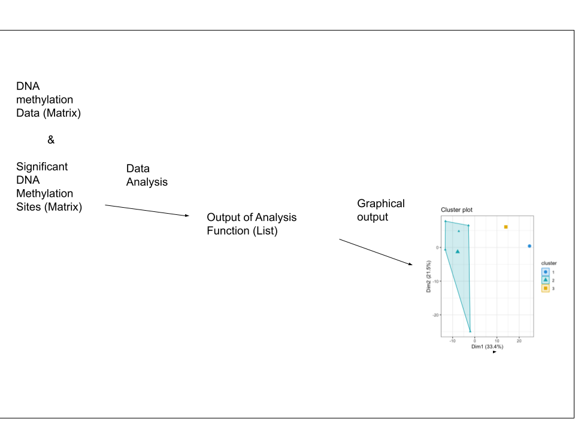

<!-- README.md is generated from README.Rmd. Please edit that file -->

# oncoCluster

<!-- badges: start -->
<!-- badges: end -->

## Description

oncoCluster is an R package used to identify cancer sub-types by using
various clustering algorithms and using single omics data as well as
integrating multi omics data. The package will allow for the user to
compare the clustering results from the different clustering algorithms.
Furthermore, it will allow the user to validate whether intergrating
data from various omics provides better results.

The `oncoCluster` package was developed using
`R version 4.2.1 (2022-06-23)`, `Platform: x86_64-apple-darwin17.0` and
`Running under: Mac OS 12.6`.

## Installation

You can install the development version of oncoCluster from
[GitHub](https://github.com/) with:

``` r
require("devtools")
devtools::install_github("ShahzadaShameelFarooq/oncoCluster", build_vignettes = TRUE)
library(oncoCluster)
```

To run the shinyApp: Under construction

## Overview

``` r
ls("package:oncoCluster")
data(package = "oncoCluster") 
browseVignettes("oncoCluster")
```

`oncoCluster` currently contains 1 function for analysis of the input
data and 1 function which provides a graphical output.

-   Analysis (1 function):

1.  Using DNA methylation data of different methylation sites from
    various samples to identify sub-types in the cancer.

-   Graphical Output

1.  The result from the Analysis function is used to get the cluster
    plot.



## Contributions

The author of the package is Shahzada Muhammad Shameel Farooq. The
*clusterAnalysis* function makes use of the filter function from `dplyr`
and the kmeans function from `stats`. The *clusterPlot* makes use of the
fviz_cluster function from `factoextra` and the theme_bw function from
`ggplot2`

## References

R Core Team (2021). R: A language and environment for statistical
computing. R Foundation for Statistical Computing, Vienna, Austria.
<https://www.R-project.org/>

H. Wickham. ggplot2: Elegant Graphics for Data Analysis. Springer-Verlag
New York, 2016.

Wickham H, François R, Henry L, Müller K (2022). *dplyr: A Grammar of
Data Manipulation*. R package version 1.0.10,
<https://CRAN.R-project.org/package=dplyr>.

Kassambara A, Mundt F (2020). *factoextra: Extract and Visualize the
Results of Multivariate Data Analyses*. R package version 1.0.7,
<https://CRAN.R-project.org/package=factoextra>.

Li, T., Chen, X., Gu, M. et al. Identification of the subtypes of
gastric cancer based on DNA methylation and the prediction of prognosis.
Clin Epigenet 12, 161 (2020).
<https://doi.org/10.1186/s13148-020-00940-3>

Scrucca L., Fop M., Murphy T. B. and Raftery A. E. (2016) mclust 5:
clustering, classification and density estimation using Gaussian finite
mixture models The R Journal 8/1, pp. 289-317

## Acknowledgements

This package was developed as part of an assessment for 2022 BCB410H:
Applied Bioinformatics course at the University of Toronto, Toronto,
CANADA. oncoCluster welcomes issues, enhancement requests, and other
contributions. To submit an issue, use the GitHub issues.
